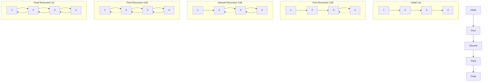

# Linked List Reversal Visualization

This README demonstrates the process of reversing a linked list using recursion.

## Visualization

The following diagram illustrates the steps of the recursive linked list reversal:

This diagram shows how the linked list is reversed step by step through recursive calls.

## Explanation

The diagram illustrates the following steps:

1. Initial List: The original linked list (1 -> 2 -> 3 -> 4)
2. First Recursive Call: The last node (4) is identified as the new head
3. Second Recursive Call: Node 3 is connected to node 4
4. Third Recursive Call: Node 2 is connected to node 3
5. Final Reversed List: Node 1 is connected to node 2, completing the reversal

For more details on the implementation, please refer to the code in this repository.
